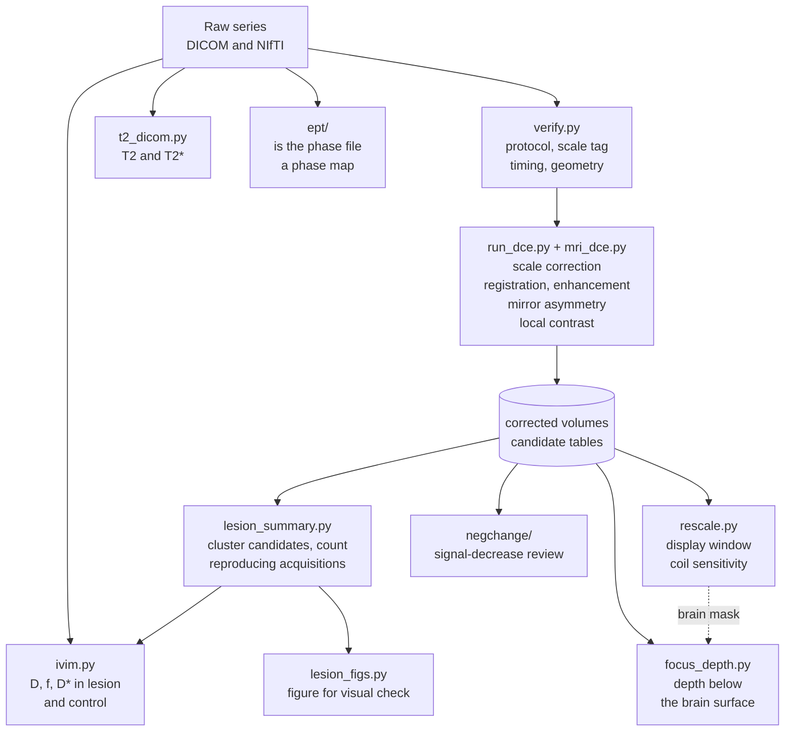

<h1 align="center">Fus_bbbo_pipeline</h1>

<p align="center">
  <b>DCE-MRI analysis of focused-ultrasound blood-brain barrier opening in the rat</b>
</p>

<p align="center">
  <a href="CHANGELOG.md"></a>
  <a href="LICENSE"></a>
  
  
  
</p>

<p align="center">
  <a href="#stages">Stages</a> &middot;
  <a href="#pipeline">Pipeline</a> &middot;
  <a href="#layout">Layout</a> &middot;
  <a href="#requirements">Requirements</a> &middot;
  <a href="#known-limitations">Known limitations</a> &middot;
  <a href="CHANGELOG.md">Changelog</a>
</p>

---

Analysis pipeline for focused-ultrasound blood-brain barrier opening (FUS-BBBO) in the
rat, measured by dynamic contrast-enhanced MRI on a 9.4 T Agilent system. T2 / T2*, IVIM
and phase-based EPT from the same sessions are processed alongside.

Written for an ongoing preclinical study. The repository is a record of how the method
was actually built: each tag is the state of the pipeline on the date that stage was
first used on real data.

## Why the versions matter

Most of what is in here is not new code but a correction to something that looked
right and was not. The changelog states each one — what was measured, what it turned
out to be, and the number that settled it. Those notes are the point of the repository.

## Stages

| Tag | First used | What it added | What it corrected |
|---|---|---|---|
| [`v0.1`](../../releases/tag/v0.1) | 2026&#8209;06&#8209;25 | DCE core pipeline | Starting point |
| [`v0.2`](../../releases/tag/v0.2) | 2026&#8209;08&#8209;20 | Agilent scale correction, T2/T2*, EPT | `FdfToDcm` renormalises pixel values per series; uncorrected, PRE and POST are not on the same axis |
| [`v0.3`](../../releases/tag/v0.3) | 2026&#8209;08&#8209;26 | Mirror asymmetry detection | Whole-tissue enhancement is not a BBBO measure: scalp and muscle are most of the voxels |
| [`v0.4`](../../releases/tag/v0.4) | 2026&#8209;09&#8209;11 | Tilted symmetry axis, cross-orientation check | Translation-only mirroring fails on a tilted head. All 33 candidates found afterwards were registration residual |
| [`v0.5`](../../releases/tag/v0.5) | 2026&#8209;09&#8209;15 | Symmetry-free local contrast, lesion depth | With both hemispheres sonicated there is no contralateral control, so detection cannot rely on symmetry |
| [`v0.6`](../../releases/tag/v0.6) | 2026&#8209;09&#8209;22 | IVIM and T2 as independent contrasts | Voxelwise f and D* are not usable at this noise level; ROI values only |
| [`v0.7`](../../releases/tag/v0.7) | 2026&#8209;09&#8209;22 | Signal-decrease and haemorrhage review | Through-plane motion is the main cause of apparent signal loss |
| [`v0.8`](../../releases/tag/v0.8) | 2026&#8209;09&#8209;28 | Display rescaling and coil sensitivity correction | A receive-coil sensitivity gradient dominates the brightness spread within the brain, so narrowing the display window alone does not work |
| [`v0.9`](../../releases/tag/v0.9) | 2026&#8209;10&#8209;01 | Contrast delivery check, EPT phase tests, DICOM T2/T2* | The local detector returns candidates in an animal with no systemic enhancement. A phase file has to be tested as a phase map before EPT |


Full detail for each stage is in [CHANGELOG.md](CHANGELOG.md).

## Pipeline



Arrows show the main inputs of each script; `top4.py`, `compare_fse.py` and the older
relaxometry drivers are left out. `run_dce.py` is the per-date driver: a new stage replaces
it with the version that was run on that date, and it writes the corrected volumes that
the scripts downstream read.

## Layout

| File | What it does |
|---|---|
| **DCE core** | |
| [`mri_dce.py`](mri_dce.py) | Shared library: DICOM loading, slab construction, registration, masks, enhancement curves, figures, GUI |
| [`run_dce.py`](run_dce.py) | Per-date DCE driver. Replaced at each stage — its history is the history of the method |
| [`verify.py`](verify.py) | Pre-analysis check: protocol, scale tag, acquisition time and geometry per series |
| [`compare_fse.py`](compare_fse.py) | FSE enhancement of the animals side by side on one scale, cropped to the brain centre |
| **Lesion level** | |
| [`lesion_summary.py`](lesion_summary.py) | Clusters candidates in patient coordinates, counts reproducing acquisitions |
| [`focus_depth.py`](focus_depth.py) | Brain mask and lesion depth below the brain surface |
| [`lesion_figs.py`](lesion_figs.py) | Per-lesion figure across sequences and orientations |
| [`top4.py`](top4.py) | Ranks candidates for a four-target design |
| **Other contrasts** | |
| [`t2_dicom.py`](t2_dicom.py) | T2 / T2* fitted directly from DICOM multi-echo series |
| [`t2_relaxometry.py`](t2_relaxometry.py) | T2 from MREPT multi-echo NIfTI (kept for comparison with `t2_dicom.py`) |
| [`run_ept_t2.py`](run_ept_t2.py) | First multi-echo T2 / T2* and phase-based EPT driver (08-20 data) |
| [`ivim.py`](ivim.py) | IVIM: segmented D / f / D* fit from a b-value series |
| [`ept/`](ept) | Phase-file validity tests for EPT: noise ratio, split-half, echo decomposition, sigma uncertainty |
| **Display and review** | |
| [`rescale.py`](rescale.py) | Display window, coil sensitivity correction, improved brain mask |
| [`negchange/`](negchange) | Signal-decrease review: through-plane shift, focal dark spots across contrasts |

## Requirements

Python 3 and six packages:

```bash
pip install numpy scipy pydicom nibabel matplotlib SimpleITK
```

Korean text in the figures needs a Korean font (`_set_korean_font` picks one up on Windows).

## Known limitations

> [!WARNING]
> **Paths and script names are hardcoded.** Each driver carries the absolute path of the
> date it was written for. This is what was actually run, and it has been left that way
> rather than rewritten after the fact. Change the constants at the top of a driver to use
> it elsewhere. Files are copied under tidied names, so a script that loads another one
> still asks for the original name (`focus_depth.py` loads `_rescale.py`).

- **The brain mask is not an anatomical segmentation.** It is a brightness threshold
  plus morphology, good enough to place a display window and to measure depth. Lateral
  and ventral boundaries still include some muscle.
- **Scanner axes, not brain axes.** The rat is prone, so scanner *axial* gives brain
  coronal sections and scanner *coronal* gives brain horizontal sections. Filenames use
  the scanner convention throughout.
- **Slice numbers are 0-indexed** in all outputs (DICOM slice N+1).

## Data

> [!IMPORTANT]
> No imaging data is in this repository and none should be added. Raw DICOM, NIfTI,
> intermediate `.npz` volumes and result figures stay local — about 25 GB at the time of
> writing.


## Tooling

`tools/build_history.py` holds the version table and rebuilt this history from the
per-date scripts. Adding a stage means adding one entry to `VERSIONS` and running it;
it commits only what has no tag yet. See its docstring.

This README is written by the same script. Edit the templates there, not this file.

Tags mark pipeline stages. Commits without a tag are tooling or documentation.


## License

[MIT](LICENSE)
